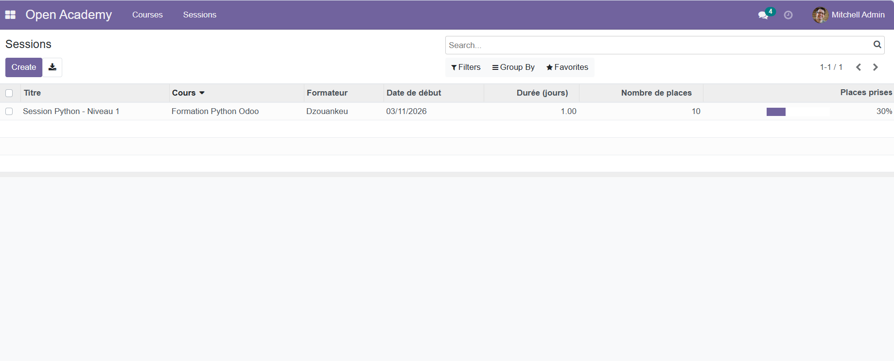
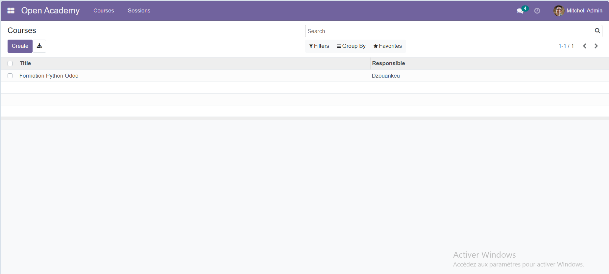

# openacademy-module
Module Odoo Open Academy pour gestion de formations
# Open Academy Module pour Odoo

## 📸 Captures d'écran

## 🚀 Fonctionnalités
- Gestion des cours de formation
- Gestion des sessions (dates, places)
- Inscription des participants
- Calcul automatique du taux de remplissage

## 🛠️ Technologies
- Odoo 15
- Python 3
- Docker
- PostgreSQL
